# Grafana Installation and Dashboard Setup on Ubuntu Server in Azure

## Introduction

Grafana is a powerful open-source analytics and visualization platform widely used for monitoring system performance. This document outlines the process of setting up Grafana on an Ubuntu virtual machine hosted on Microsoft Azure. The setup involves installing Grafana, configuring the necessary dependencies, setting up Azure Monitor as a data source, and visualizing system performance metrics. Additionally, the document highlights security configurations, networking considerations, and troubleshooting steps taken to resolve issues encountered during the installation and setup process.


## Setup Process

### Step 1: Create an Ubuntu VM in Azure
1. **Log in to Azure Portal** and navigate to **Virtual Machines**.
2. Click **Create > Azure Virtual Machine**.
3. Fill in the details:
   - **Subscription:** Select your subscription.
   - **Resource Group:** Create a new one or use an existing one.
   - **Virtual Machine Name:** Ubuntu-Grafana
   - **Region:** Choose a nearby region.
   - **Image:** Select Ubuntu 20.04 LTS.
   - **Size:** Choose a size like Standard B1s or B2s.
   - **Authentication Type:** SSH public key or Password.
   - **Username:** adminuser.
   - **Networking:** Ensure SSH (22) is allowed.
4. Click **Review + Create**, then **Create**.

   
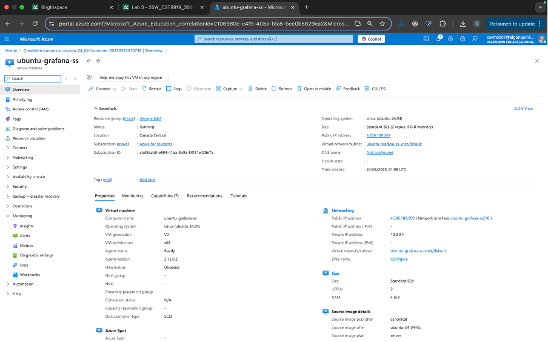
   
### Step 2: Connect to Your Ubuntu VM
1. Go to **Virtual Machines** and select your Ubuntu-Grafana VM.
2. Copy the **public IP address**.
3. Open Terminal and connect via SSH:
   ```sh
   ssh adminuser@<your-vm-public-ip>
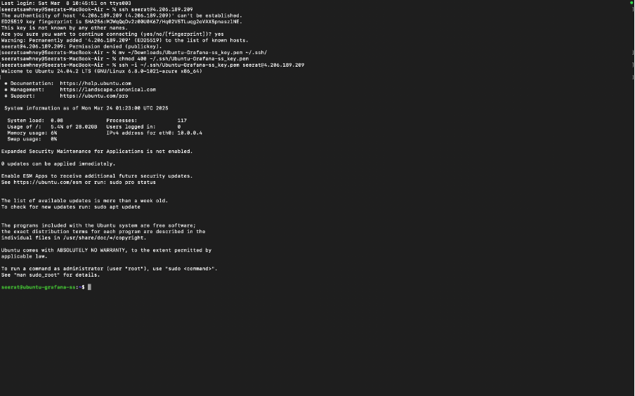
   
    ```
5. Enter the password if prompted.

### Step 3: Prepare Ubuntu Server
1. Update system packages:
   ```sh
   sudo apt-get update && sudo apt-get upgrade -y
   ```
   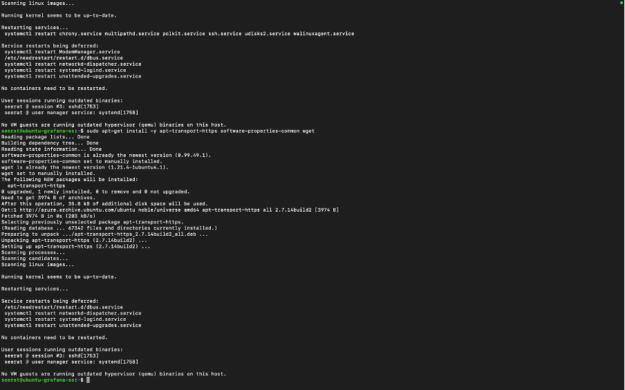
   
3. Install dependencies:
   ```sh
   sudo apt-get install -y apt-transport-https software-properties-common wget
   ```

### Step 4: Install Grafana
1. Add Grafana’s official APT repository:
   ```sh
   sudo mkdir -p /etc/apt/keyrings/
   wget -q -O - https://apt.grafana.com/gpg.key | gpg --dearmor | sudo tee /etc/apt/keyrings/grafana.gpg > /dev/null
   echo "deb [signed-by=/etc/apt/keyrings/grafana.gpg] https://apt.grafana.com stable main" | sudo tee -a /etc/apt/sources.list.d/grafana.list
   ```
2. Install Grafana:
   ```sh
   sudo apt-get update
   sudo apt-get install grafana -y
   ```

   
   
4. Start and enable Grafana service:
   ```sh
   sudo systemctl daemon-reload
   sudo systemctl start grafana-server
   sudo systemctl enable grafana-server
   ```
5. Verify Grafana is running:
   ```sh
   sudo systemctl status grafana-server
   ```
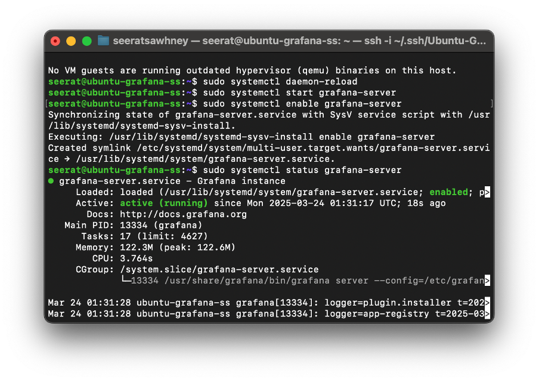

### Step 5: Allow Port 3000 for Grafana
```sh
sudo ufw allow 3000/tcp
sudo ufw status
```

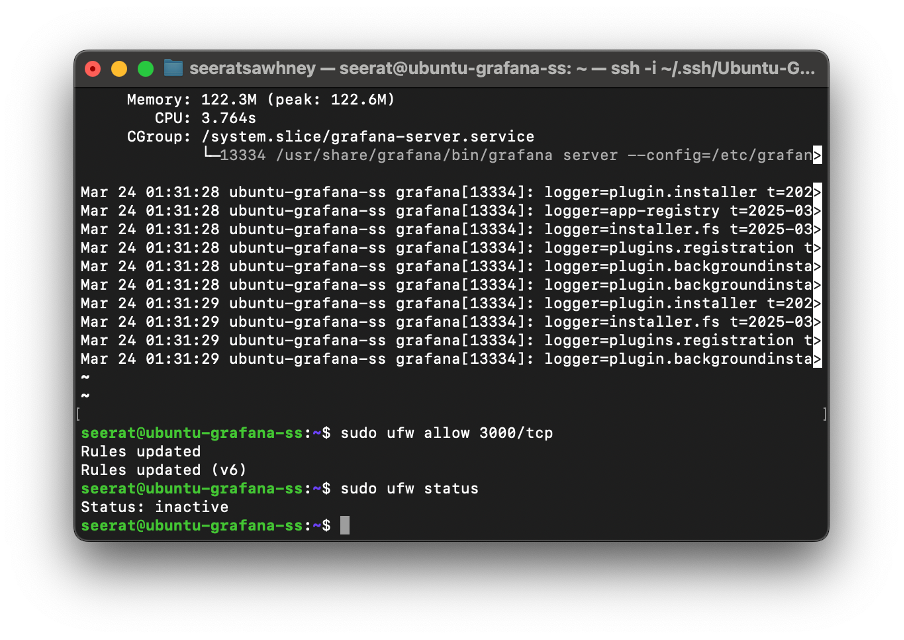

### Step 6: Connect Grafana to Azure Monitor
1. **Enable Managed Identity for the VM:**
   - Go to **Azure Portal > Virtual Machines > Ubuntu-Grafana**.
   - Click **Identity** > **System assigned** > **On** > **Save**.
2. **Assign Permissions:**
   - Go to **Azure Monitor > Access Control (IAM)**.
   - Add **Monitoring Reader** role to VM’s Managed Identity.
   - Go to **Subscriptions > IAM > Add role assignment**.
   - Assign **Reader Role** to the same Managed Identity.
3. **Configure Managed Identity in Grafana:**
   ```sh
   sudo nano /etc/grafana/grafana.ini
   ```
   Edit the following:
   ```ini
   [auth.azure]
   enabled = true
   managed_identity_enabled = true
   ```
   Save and restart Grafana:
   ```sh
   sudo systemctl restart grafana-server
   ```
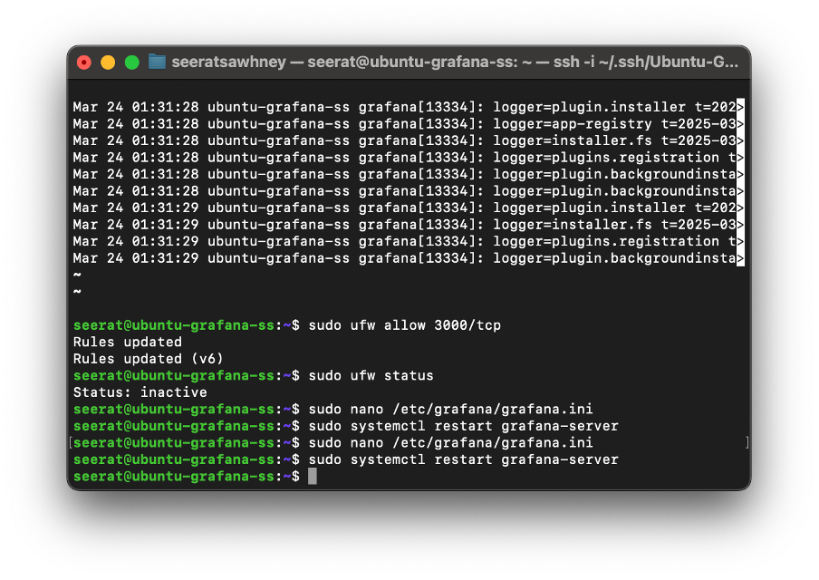
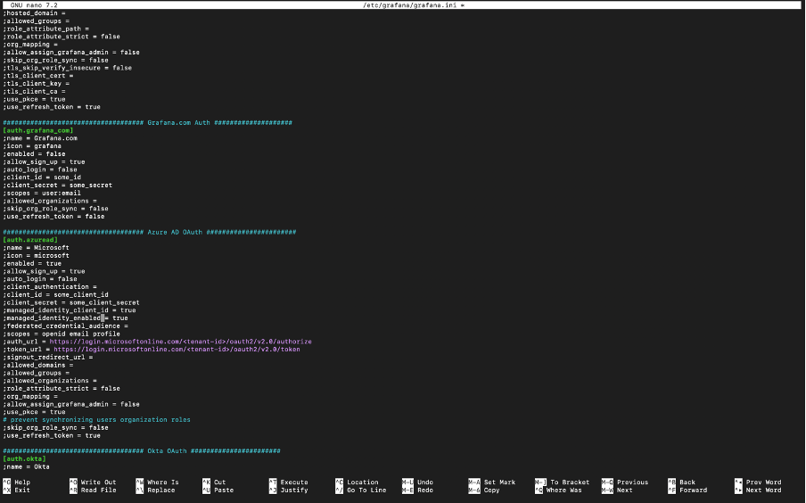

### Step 7: Access Grafana and Add Data Source
1. Open **http://<your-vm-public-ip>:3000**.
   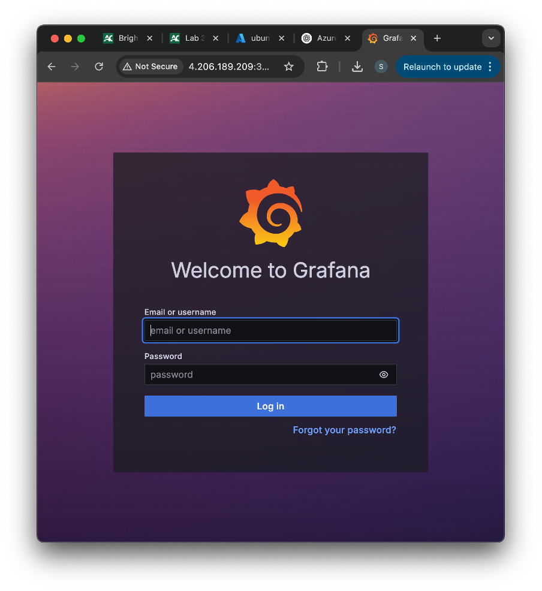
   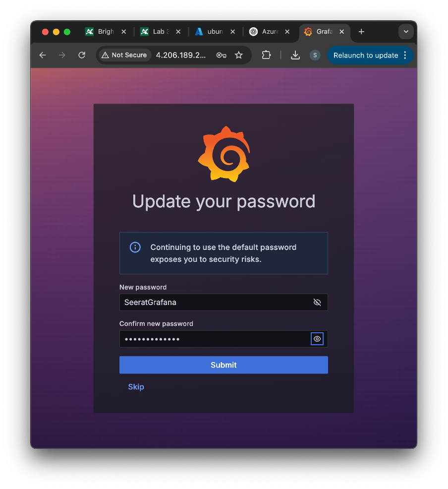
3. Log in with:
   - **Username:** admin
   - **Password:** admin (change it after first login).
4. Add **Azure Monitor** as Data Source:
   - Click **Configuration > Data Sources > Add data source**.
   - Select **Azure Monitor**.
   - In **Authentication**, choose **Managed Identity**.
   - Click **Save & Test**.
       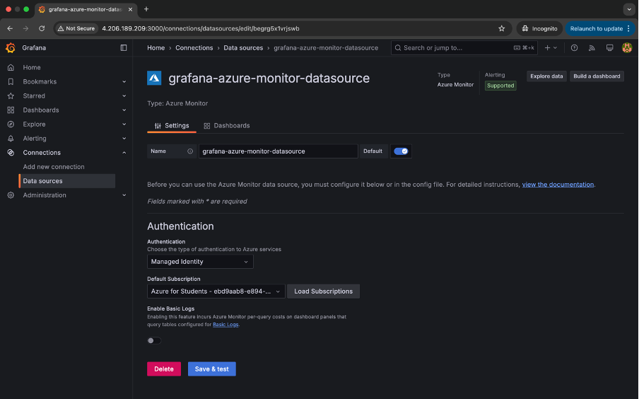

### Step 8: Create a Dashboard
1. Click **+** on the left sidebar > **Dashboard**.
2. Click **Add new panel**.
3. Select **Azure Monitor** as the data source.
     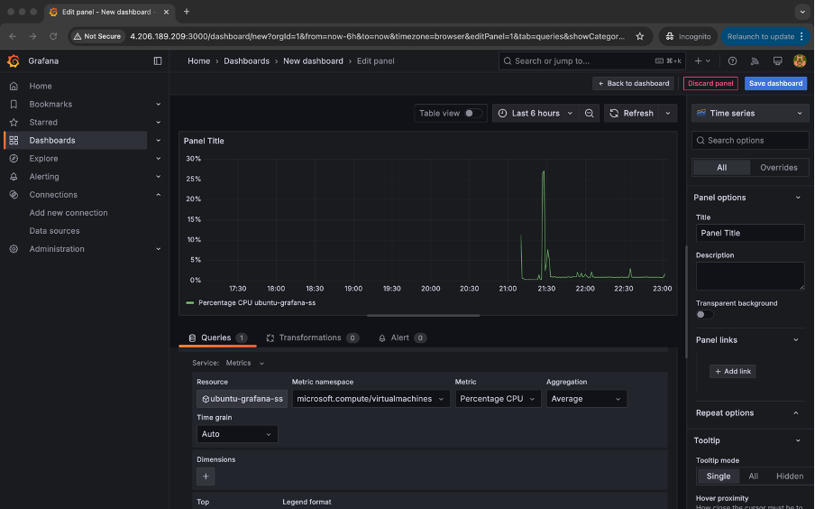
5. Choose metrics like:
  - [x] Add CPU metrics panel
- [x] Add memory metrics panel
- [x] Add disk I/O panel
- [x] Add network I/O panel
- [x] Save and test dashboard
        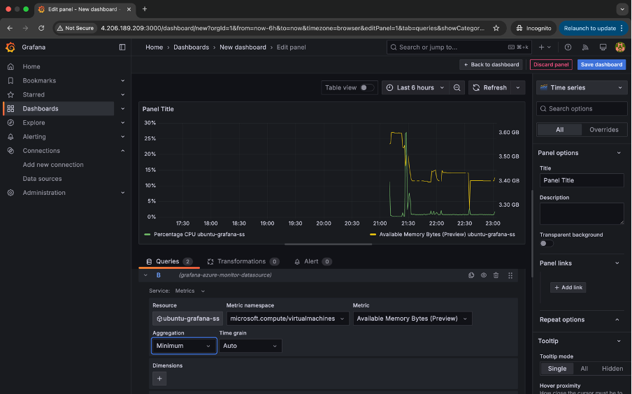
        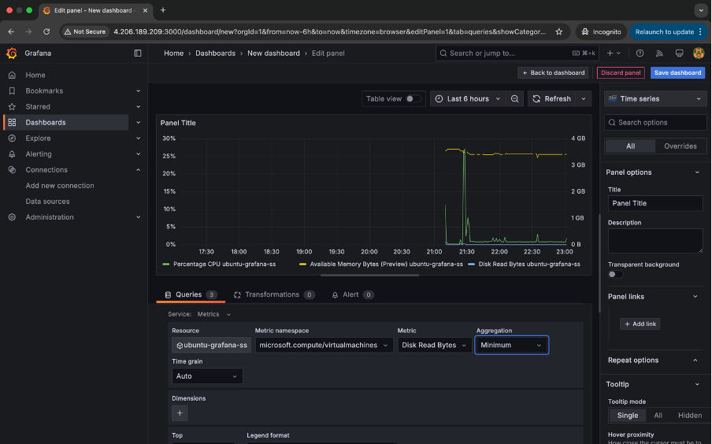
        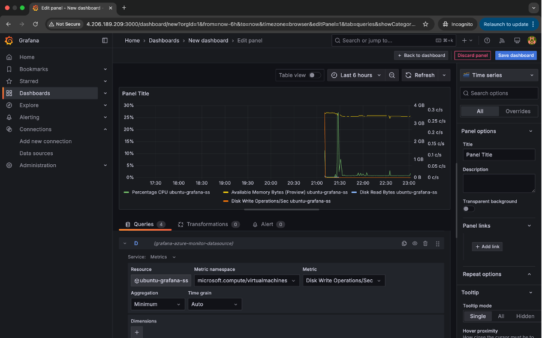
      
5. Customize visualization and click **Apply**, then **Save Dashboard**.
     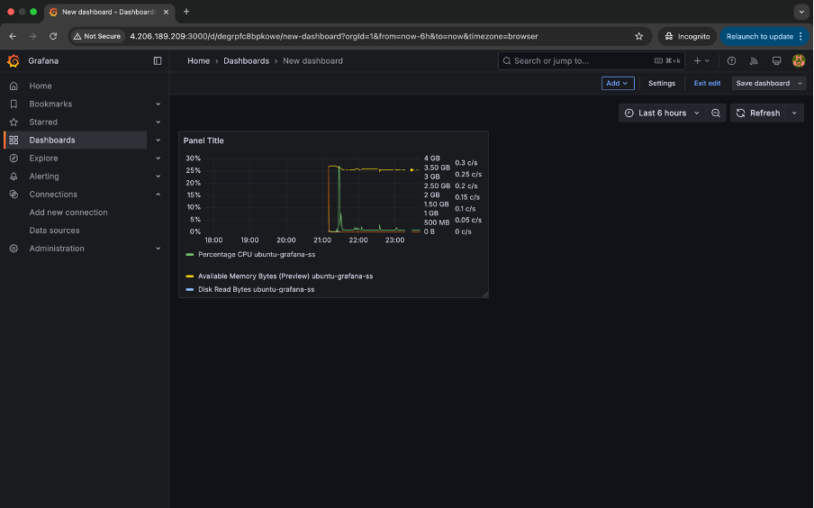

---

## Issues Encountered
### Problem: Entra ID Not Working
- **Issue:** Unable to configure the Managed Identity due to Entra ID issues in Azure.
- **Solution Attempted:** Verified IAM role assignments and tried enabling the identity again.
- **Current Status:** Data source can fetch metrics.

### Problem: Initial Inability to Access Grafana Interface
- **Issue:** Could not access Grafana on port 3000 initially.
- **Solution:** Added an inbound security rule for port 3000 in Azure VM networking settings.
  
---

## Conclusion

The installation and configuration of Grafana on an Azure-hosted Ubuntu virtual machine were successfully completed. All necessary steps, including setting up the Ubuntu server, installing Grafana, configuring the Azure Monitor data source, and ensuring proper inbound security rules, were executed smoothly. With the configuration in place, the Grafana dashboard now accurately visualizes system performance metrics such as CPU usage, memory usage, and network I/O. The system is fully functional, and the monitoring setup provides valuable insights into the server's health and performance. This setup ensures a solid foundation for ongoing monitoring and optimization of cloud-based infrastructure.


